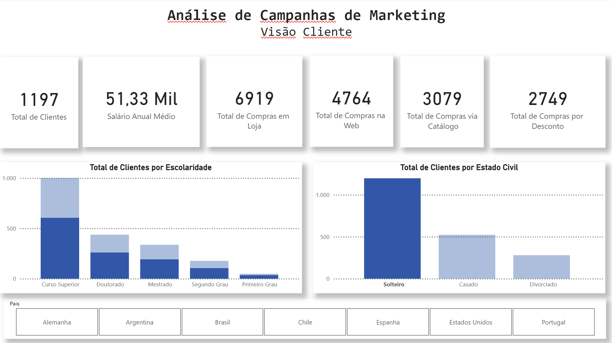
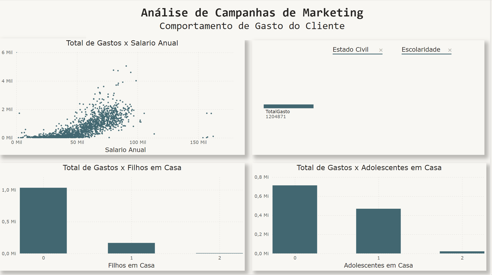
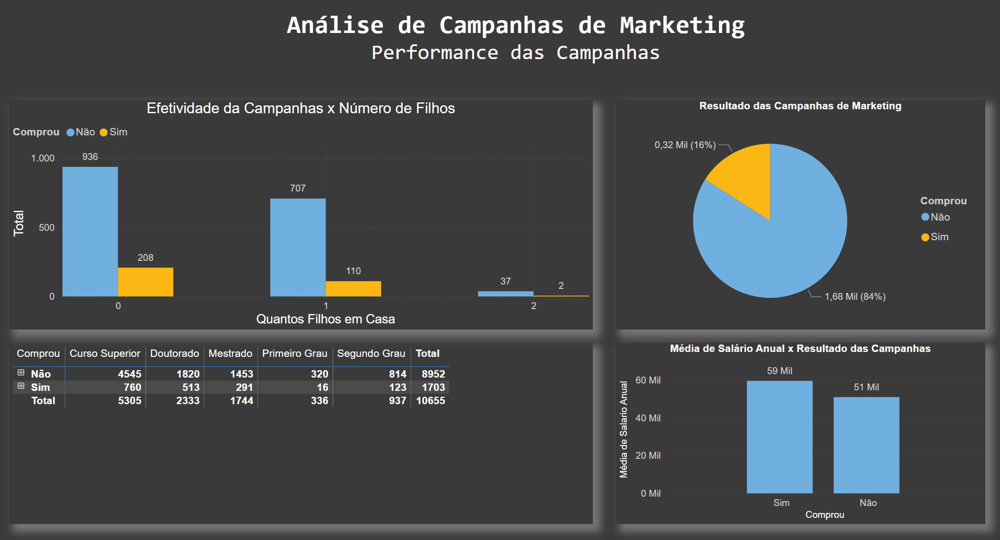
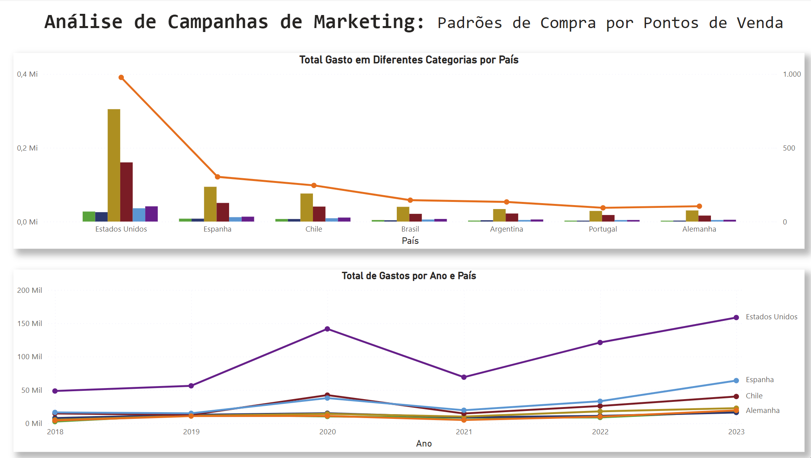

# PowerBI - Projeto 1: Análise de Dados de Marketing

Um projeto de análise de dados para demonstrar funcionalidades do PowerBI. Dados fictícios são utilizados para analisar a efetividade de campanhas de marketing na venda de produtos. Baseado no curso "Business Intelligence e Data Science" da Data Science Academy.

O objetivo geral do projeto é gerar insights para uma equipe de marketing através de uma série de informações estruturadas no arquivo dados_marketing.csv:

- O perfil de clientes de uma empresa fictícia (idade, escolaridade, nacionalidade, número de filhos, etc);
- Os respectivos gastos de cada cliente em diferentes setores (alimentação, vestuário, utilidades, móveis, etc);
- O número de compras realizadas por via (catálogos, web, lojas físicas) e booleanos caracterizando se compras ocorreram durante determinada campanha de marketing.

São criados, portanto, diversos relatórios divididos em 4 visões:
•Visão do Cliente;
•Visão do Comportamento de Compra do Cliente;
•Visão da Performance das Campanhas de Marketing;
•Visão dos Padrões de Compra no Ponto de Venda (País)

Para cada visão trabalha-se a análise dos dados, a criação de gráficos e medidas, a extração de métricas e o cruzamento entre os dados, visando entregar aos tomadores de decisão uma visão bastante completa sobre o perfil dos clientes, os padrões de compra e a efetividade das campanhas de Marketing.

## Visão Cliente

Visão focada no perfil de 2000 clientes distintos, separados por escolaridade,, estado civil e país.
- Total de Clientes por Escolaridade: A maioria dos clientes possui curso superior, seguido por doutorado e mestrado, com menores números para segundo e primeiro grau.
- Total de Clientes por Estado Civil: A maior parte dos clientes é solteira, seguida por casados e divorciados.
- Países: quase metade do total de clientes residem nos Estados Unidos

---

## Comportamento de Gastos do Cliente

A segunda página do relatório foca no comportamento de gasto do cliente.

- Gráficos de Dispersão e Barras: o gráfico de dispersão mostra uma correlação positiva entre o salário anual e o total de gastos dos clientes. A maioria dos clientes com menor salário também tem gastos menores, enquanto aqueles com salários mais altos tendem a gastar mais.
- Filtros: há filtros para Estado Civil e Escolaridade, que possibilitam segmentar o total de gastos.
- Total de Gastos x Filhos em Casa: A maior parte do total de gastos provém de clientes que não possuem filhos em casa, seguido por aqueles com 1 ou 2 filhos.
- Total de Gastos x Adolescentes em Casa: Clientes que não têm adolescentes em casa representam a maior parte dos gastos. O gasto diminui à medida que o número de adolescentes em casa aumenta.

Esse layout oferece uma análise sobre como fatores demográficos, como a presença de filhos ou adolescentes, influenciam o comportamento de consumo dos clientes.

---

## Performance das Campanhas

A terceira página do relatório foca na performance das campanhas de marketing.

- Efetividade da Campanha x Número de Filhos: Este gráfico de barras mostra a relação entre o número de filhos em casa e a adesão à campanha (compra). Clientes sem filhos tiveram uma taxa de compra maior, enquanto a taxa de compra diminui conforme aumenta o número de filhos.
- Resultado das Campanhas de Marketing: O gráfico de pizza mostra que 84% dos clientes não compraram (1,68 mil), enquanto 16% dos clientes compraram (0,32 mil), indicando que a campanha atingiu uma minoria dos clientes.
- Compras x Escolaridade: A tabela detalha o número de compras de acordo com o nível de escolaridade. Nota-se que clientes com curso superior e doutorado estão mais presentes na categoria "Não comprou", enquanto há menor participação de pessoas com níveis educacionais mais baixos.
- Média de Salário Anual x Resultado das Campanhas: Este gráfico compara a média de salário anual entre clientes que compraram e não compraram. A média salarial dos que compraram é de 59 mil, enquanto a dos que não compraram é de 51 mil, indicando que a campanha foi mais efetiva entre aqueles com maior renda.

Esses dados fornecem uma visão sobre quais segmentos de clientes responderam melhor às campanhas e sugerem que o nível educacional e a renda são fatores que influenciam a adesão.

---

## Padrões de Compra por Ponto de Venda

A quarta e última página do relatório foca na separação de vendas e gastos por categoria nos diferentes países. 

- Total Gasto em Diferentes Categorias por País: A linha de tendência sugere que os Estados Unidos têm os maiores gastos por categoria, seguido de uma queda acentuada nos países seguintes.
- Total de Gastos por Ano e País: É um gráfico de linhas que mostra a evolução do total de gastos por ano, de 2018 a 2023, para os países contemplados. Novamente os Estados Unidos destacam-se com um crescimento contínuo e mais expressivo. Outros países, como Espanha, Chile e Alemanha, mostram uma tendência de estabilidade ou crescimento menor.
